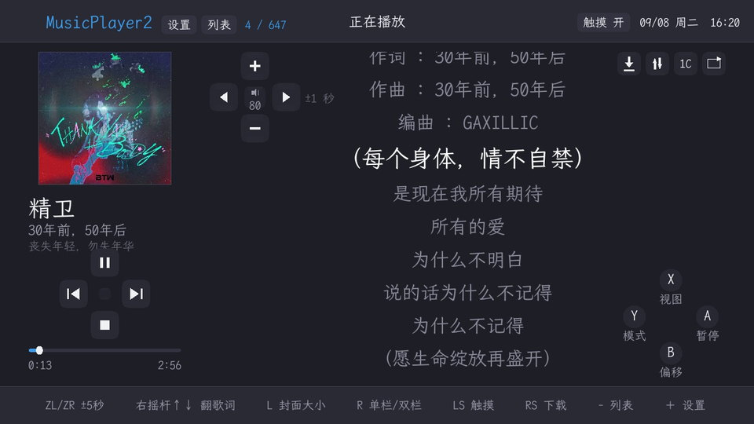
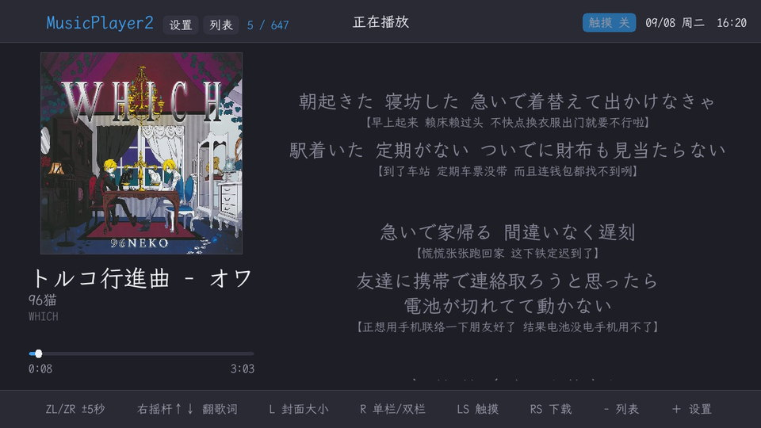
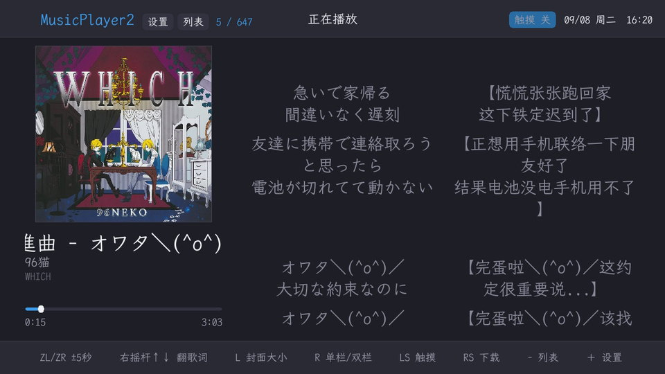

# MusicPlayer2 for Nintendo Switch

[MusicPlayer2](https://github.com/zhongyang219/MusicPlayer2) 的 Nintendo Switch homebrew 移植版。

桌面版基于 MFC，界面层和音频层无法交叉编译到 Switch，因此这两层是重写的；
播放列表、歌词解析、在线下载等与平台无关的逻辑与桌面版保持一致。

本仓库只放移植版。它不依赖桌面版的任何源文件，所以从上游拆出来单独维护——
上游是一个 MFC 的 Windows 工程，把 devkitPro 工具链塞进去对双方都是负担。

> 想改代码？先看 [系统架构](docs/ARCHITECTURE.md) 和 [开发指南](docs/DEVELOPMENT.md)。

屏幕上三个操作区分别对应方向键、ABXY、左摇杆，形状本身就是键位表。

| 沉浸模式 | 双栏歌词 |
| --- | --- |
|  |  |

关掉触摸即进入沉浸模式：屏上按钮全部收起，封面放大，只剩封面、曲目信息和歌词。

---

## 安装

1. 从 [Releases](https://github.com/Schweik7/MusicPlayer2-Switch/releases) 下载 `MusicPlayer2.nro`
2. 放到 SD 卡的 `/switch/` 目录
3. 从 hbmenu 启动

配置、缓存和自带字体放在 `sdmc:/config/MusicPlayer2/`（homebrew 的惯例位置）。
从 0.6.2 及更早版本升级时，旧位置 `sdmc:/switch/MusicPlayer2/` 里的配置会自动搬过去。

首次使用：按 `＋` 进设置 → **浏览 SD 卡** → 进到你的音乐目录 → 按 `Y` 设为默认音乐目录。
以后启动会自动扫描这个目录。

### 放到 HOME 界面上

想让它和游戏并排出现在 HOME 界面、不必每次长按 R 进 hbmenu，用
[sphaira](https://github.com/NaGaa95/sphaira) 给这个 NRO 生成一个前端启动（forwarder）即可，
它在机器上就能做完。装好的图标本身不含播放器，只负责把 SD 卡上的 NRO 加载起来，
所以之后更新播放器只换 `MusicPlayer2.nro`，图标不用重装。

本项目不自带这个功能：sphaira 已经把它做好了，而且它对任何 NRO 都通用。

---

## 功能

### 播放

- **格式**：MP3、FLAC、OGG、Opus、WAV、AIFF、MOD/XM/S3M/IT、MIDI
- **播放模式**：顺序、随机、列表循环、单曲循环、单曲播放
- **三档进度精度**：右摇杆左右快速拖动、ZL/ZR ±5 秒、左摇杆左右 ±1 秒
- **频谱显示**：Hann 窗 + FFT，按对数分组成条
- 退出时记住播放列表、曲目与播放位置

FLAC 走的是自己接的 libFLAC 解码路径（devkitPro 的 SDL_mixer 没有启用 FLAC）。

MP3、WAV、Ogg、Opus 的时长由本程序自己从文件头算出（读 Xing/Info/VBRI 帧、
WAV 的字节率、Ogg 末页的 granule）。devkitPro 带的 SDL_mixer 是 2.0.4，
没有 `Mix_MusicDuration`，不自己算的话进度条右侧永远是 `-:--`，也没法拖动定位。

### 曲目信息与封面

- **读取音频标签**：ID3v2.2/2.3/2.4、ID3v1、FLAC 与 Ogg/Opus 的 Vorbis comment
- **内嵌封面**：FLAC 的 PICTURE 块、MP3 的 APIC 帧；没有内嵌封面时回退到同目录的图片文件
- 点击封面可全屏放大
- **写回文件**：下载到的歌词和封面可以选择直接嵌进 MP3 / FLAC（设置里开启）。
  不需要 ffmpeg——封面和歌词都在文件开头的标签区里，重写标签区就行，音频帧一个字节都不用动

读标签而不是靠文件名，是因为 Switch 的文件系统不支持非 ASCII 文件名（见「已知限制」），
中文歌传上去只能改成拼音。标签是文件内部的文本，不受这个限制。

### 歌词

- LRC 歌词，支持**逐字高亮**（卡拉 OK 效果）
- **双语显示**：单栏（译文在原文下方）或双栏（左原文右译文，同步滚动），按 `R` 或设置里切换
- **背景图**：歌词区可以铺一张背景图，用当前曲目的封面，或自己放一张
  `background.jpg` 到 `sdmc:/config/MusicPlayer2/`（设置里选）
- 长句**自动换行**，不会被省略号截断
- 歌词偏移调整（`B` + 方向键左右，每次 0.5 秒）。**默认关闭**，在设置里打开——
  多数歌词的时间轴是准的，关掉之后 `B` 才能腾出来做别的用
- **手指拖动翻看**：默认松手几秒后自动滑回当前播放的那句；
  打开歌词区右上角的同步按钮后，松手即跳转，歌曲进度跟着走

### 在线下载

- 从**网易云音乐**或 **QQ 音乐**下载歌词与封面
- 自动匹配综合标题、艺术家、专辑、文件名的编辑距离，**并参考时长**——
  同名的不同版本（Live、伴奏、加长版）光看文字分不出来，时长却一目了然
- 也可以手动从搜索结果里挑
- HTTPS 会校验服务器证书

### 界面与操作

- **手柄和触摸各自都能走完全程**：手柄能做的事触摸都能做，反过来也一样。
  顶栏常驻返回 / 设置 / 列表 / 播放模式 / 音量 / 触摸开关，任何界面都出得来
- **屏幕上的按钮就是键位表**：左下角四个按钮按方向键的十字排布，
  右下角四个按 ABXY 的菱形排布，点哪个就等于按哪个键
- **触摸操作**：走带按钮、进度条点击与拖动、列表拖动滚动（带松手惯性）、点列表项直接播放
- **触摸开关 / 沉浸模式**：按下左摇杆或点顶栏按钮即可关闭，避免手持时误触
- **底部键位提示可隐藏**（设置里），歌词区随之变高
- 顶栏左侧集中放返回 / 设置 / 列表 / 触摸开关和曲目计数，右侧是日期时间和**电量**
- **深色 / 浅色两套配色**，在设置里切换，即时生效
- **界面语言**：简体中文（默认）/ English，在设置里切换，即时生效
- 曲目名过长时**自动滚动**，两端各停顿一下再折返
- 文字用 **Switch 系统共享字体**，自带中日韩字形。
  想换字体就把一个 `font.ttf` 放进 `sdmc:/config/MusicPlayer2/`，系统字体会留作兜底

### 省电与维护

- **空闲自动调暗屏幕**：真的降低背光而不是盖一层黑色。亮度是全局设置，
  程序会记下你原来的值，唤醒和退出时还原
- **自动更新**：从 GitHub Release 检查并安装新版本。
  GitHub 连不上时自动回退到备用源 `download.psyventures.cn`（走 HTTPS，同样验证证书）。
  设置里可以指定更新源——GitHub 在部分地区要等到超时才失败，
  选「仅备用源」就不必白等那十几秒。
  **更新分下载和重启两步**：运行中换不动正在使用的 NRO，所以下载完要重启一次，
  新版本在下次启动时自动换上
- **后台扫描音乐库**：几百首歌读标签要十秒左右，扫描放在后台线程，界面立即可用
- **按需加载字体**：六档字号 × 六个回退字体共 36 次字体解析改成用到哪档才解析哪档，
  不再全堵在启动路径上。各阶段耗时可以在「设置 → 关于」里看到

---

## 操作

### 播放界面

| 输入 | 功能 |
|---|---|
| 方向键 ← → | 上一曲 / 下一曲 |
| 方向键 ↑ / ↓ | 播放暂停 / 停止 |
| 左摇杆 ↑ ↓ | 音量（歌词区左上角也能点） |
| 左摇杆 ← → | 快退 / 快进 1 秒 |
| 右摇杆 ← → | 拖动进度（快速） |
| 右摇杆 ↑ ↓ | 翻看歌词（等同用手指拖） |
| ZL / ZR | 快退 / 快进 5 秒 |
| A | 播放 / 暂停（大封面视图下是全屏查看） |
| L | 封面放大 / 缩小 |
| R | 歌词单栏 / 双栏 |
| X | 切换视图（歌词 / 频谱 / 大封面） |
| Y | 切换播放模式 |
| 按下右摇杆 | 在线下载歌词封面 |
| 按下左摇杆 | 开关触摸操作（任何界面都有效） |
| − | 播放列表 |
| ＋ | 设置 |
| B 连按两次 | 退出程序 |
| B + 方向键 ← → | 歌词偏移 ∓0.5 秒（需在设置里开启） |

屏幕上有三个操作区，形状分别对应三个物理输入，点它们等于按对应的键：

- **左下角**十字 —— 方向键（播放暂停 / 上下一曲 / 停止）
- **右下角**菱形 —— ABXY
- **歌词区左上角**十字 —— 左摇杆（上下音量、左右逐秒进退，中心显示音量）

歌词区右上角还有一排四个小按钮：下载、"拖歌词是否带着进度走"、单栏/双栏、播放模式。
当前是第几首 / 共几首显示在顶栏。

**关掉触摸就是沉浸模式**：这些按钮全部收起，左栏的封面随之放大，屏幕只剩封面、
曲目信息和歌词。它们的功能手柄上都有，不会丢；按下左摇杆（LS）随时切回来。

按住实体键时，屏幕上对应的那个按钮会同步高亮——三个操作区本来就是照着实体键排的。

### 列表 / 文件浏览

| 输入 | 功能 |
|---|---|
| 方向键 / 左摇杆 | 移动光标 |
| L / R | 上下翻页 |
| A | 播放 / 打开 |
| B | 返回 / 上级目录 |
| X | 播放整个目录（仅文件浏览） |
| Y | 设为默认音乐目录并载入（仅文件浏览） |
| ＋ | 设置 |

### 在线下载

| 输入 | 功能 |
|---|---|
| A | 下载选中项 |
| X | 输入搜索词 |
| Y | 切换音乐源（网易云 / QQ 音乐） |
| ZL / ZR | 下载歌词 / 下载封面 开关 |
| ＋ | 是否写进歌曲文件 |
| − | 取消正在进行的下载 |
| B | 返回 |

顶部那一行整行都能点：搜索框点开键盘，右边四个格子是音乐源和三个开关。

---

## 已知限制

### SD 卡上的非 ASCII 文件名无法识别

这是 Switch 文件系统层面的限制，不是本程序的问题——第三方 homebrew（ftpd 等）
在同一张卡上同样无法创建或列出中文名文件。GBAStation 之类的传输工具把中文名转成拼音，
正是出于同样的原因。

**影响**：文件名只能是 ASCII。但曲目信息改为从标签读取后，列表里显示的仍是正确的中文
标题和艺术家，日常使用基本不受影响。

实测数据见 [系统架构 · 平台约束](docs/ARCHITECTURE.md#4-平台约束实机测出来的)。

### 其它

- 不支持 cue 分轨
- MIDI 需要 SD 卡上有 GUS 音色库才能出声
- Ogg/Opus 的内嵌封面（base64 编码在注释里）暂未支持
- 歌词封面**只能写进 MP3 和 FLAC**。Ogg / Opus 的注释头包在 Ogg 页里，
  改一个字段要重新分页并重算每一页的 CRC，那才是真需要一个容器库
- 缺少 Xing/VBRI 头的 VBR MP3，时长是按平均码率估的，会有偏差
- 不支持后台播放（需要 sysmodule + overlay 架构，见「后续计划」）

### 更新检查报证书错误？

先校准主机系统时间。时间偏差过大会让所有证书被判为过期，程序会在错误信息里指出这一点。

---

## 后续计划

- **sysmodule + Tesla overlay**：后台常驻播放，`L + 方向键下` 唤出控制面板。
  overlay 是短命进程，留不住音乐，因此需要拆成「无界面的播放 sysmodule」+「overlay 遥控器」
  两部分（与 sys-tune 同构）。sysmodule 里用不了 SDL，音频层要换成直接调 audout。
- cue 分轨
- 整个播放列表批量下载歌词

---

## 文档

| 文档 | 内容 |
| --- | --- |
| [系统架构](docs/ARCHITECTURE.md) | 分层、模块职责、关键设计决定、实机测出的平台约束 |
| [开发指南](docs/DEVELOPMENT.md) | 构建、测试、部署、实机诊断、发版、自动更新的实现、上架素材 |

---

## 许可证

GPL-3.0，与上游一致。移植版是 [MusicPlayer2](https://github.com/zhongyang219/MusicPlayer2)
的衍生作品，见 [LICENSE](LICENSE)。

## 致谢

- 上游项目 [zhongyang219/MusicPlayer2](https://github.com/zhongyang219/MusicPlayer2)
- [devkitPro](https://devkitpro.org/) 与 libnx
- [GBAStation](https://github.com/beiklive/GBAStation) —— 自动更新替换不掉自身那个坑，
  是照着它的更新器才定位到"挂着 romfs 时 NRO 文件被按住"这一条
